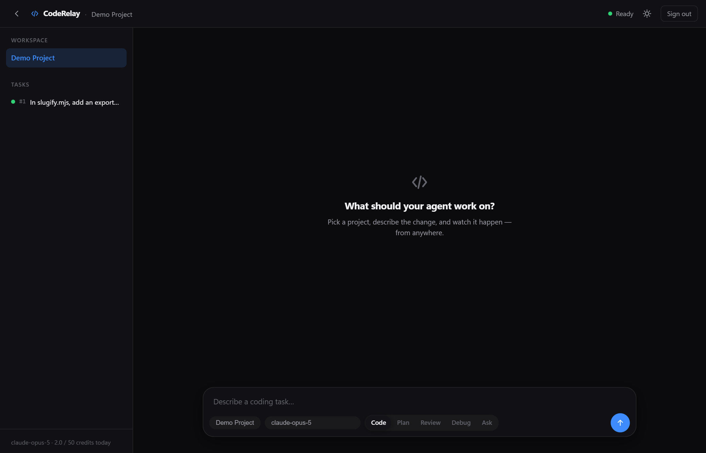
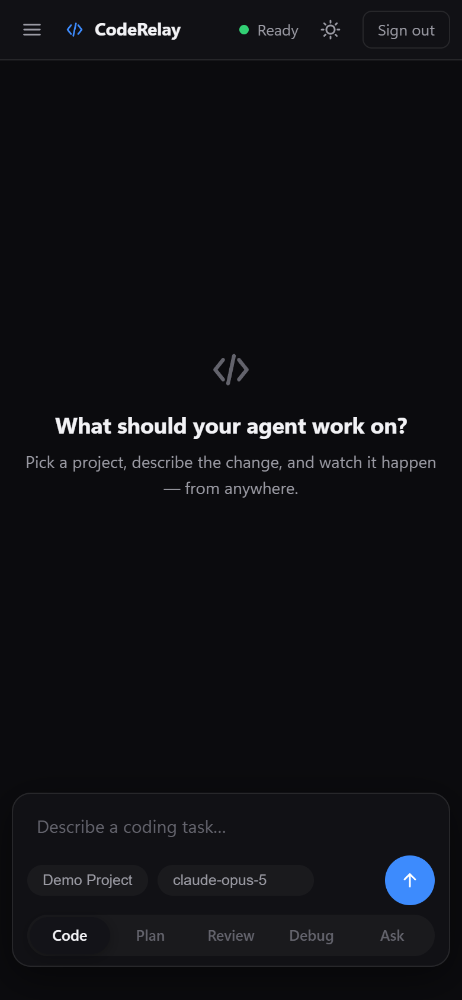
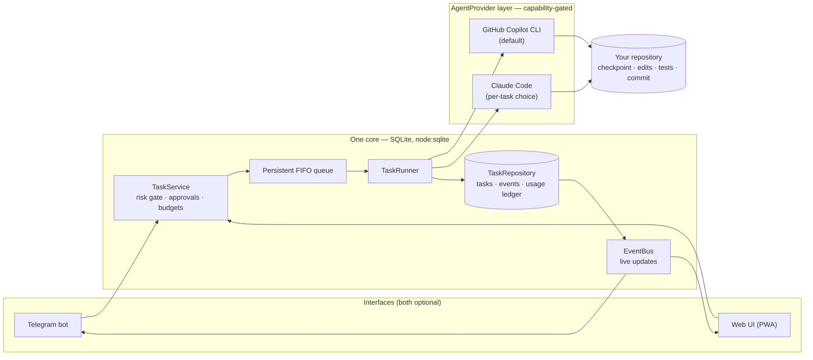
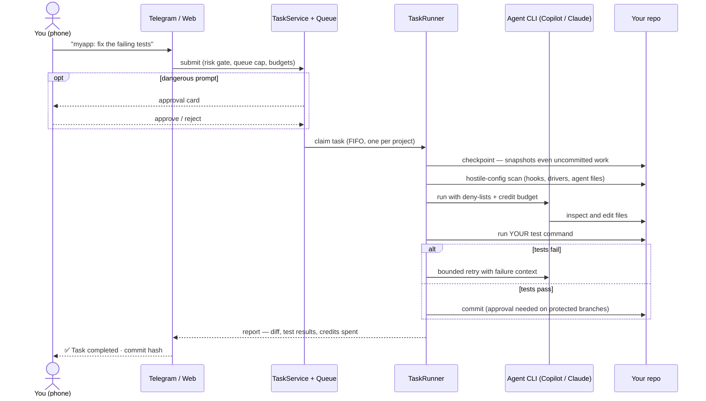

# CodeRelay

**Remote-control your own coding agents.** Send a coding task from your phone — your home PC runs it with the AI coding CLI you already pay for (GitHub Copilot or Claude Code), runs your tests, and reports back.

[](https://github.com/Tayebbb/CodeRelay/actions/workflows/ci.yml)
[](LICENSE)
[](https://nodejs.org)
[](package.json)

> **You**, from anywhere: _"myapp: fix the failing date parser tests"_
>
> **Your PC at home:** snapshots the repo → runs the coding agent → runs
> _your_ tests → commits when they pass
>
> **You**, two minutes later: ✅ _Task completed · 2 files changed · 48 tests
> passed · commit `8f31a92`_ — with the full diff, on your phone.

- **Free to run.** Uses the AI subscription you already have — GitHub Copilot by default, Claude Code as an alternative. Pick the agent CLI **and** model per task from the web app. No server, no hosting, no extra monthly bill.
- **Two ways in.** Telegram bot, an installable web app, or both — same tasks, same history, either one is optional.
- **No surprise AI spend.** CodeRelay does not automatically perform additional AI actions beyond your request — no task, no AI call. Reboots, restarts and idle time cost zero credits, and every task runs under hard daily and per-task budgets.
- **Survives reboots.** `npm run agent -- startup install` once, and Windows starts it at logon and restarts it after a crash — no terminal, no VS Code window, no admin rights.
- **Built paranoid.** Your uncommitted work is snapshotted before every task, nothing is pushed without your approval, and secrets never leave the machine.

<p align="center">
  
  
</p>
<p align="center"><sub>The web interface — desktop and phone. Light theme included. Every screenshot is the real app.</sub></p>

## Get started in five minutes

You don't need to be a programmer to set this up — every step below is
copy-paste. You need three things first, each a normal installer:

1. **[Node.js 22.5+](https://nodejs.org)** — the runtime CodeRelay runs on
2. **[Git](https://git-scm.com/download/win)** — how the code is downloaded and how your work is protected
3. **A GitHub Copilot subscription** — the AI (Claude Code works too, see [Configuration](#configuration))

Then open **PowerShell** on the PC that has your code and paste, block by block:

**Step 1 — download and build CodeRelay:**

```powershell
git clone https://github.com/Tayebbb/CodeRelay.git
cd CodeRelay
npm install
npm run build
```

**Step 2 — connect the AI** (a browser window opens to sign in with GitHub):

```powershell
npm install -g @github/copilot
copilot login
```

**Step 3 — create your web password and switch the web app on.** The prompt
shows a `*` for each key you press; add `--show` at the end if you'd rather
see the letters:

```powershell
npm run agent -- web setup
Add-Content .env "WEB_ENABLED=true"
```

**Step 4 — tell it where your project lives and how to test it:**

```powershell
npm run agent -- projects add MyApp "C:\code\myapp" --test "npm test"
```

**Step 5 — start it:**

```powershell
npm start
```

Now open **http://127.0.0.1:8787** in your browser, sign in with the password
from step 3, type what you want done, and watch it happen live.

**Step 6 (optional but worth it) — make it permanent.** One command makes
CodeRelay start by itself every time you sign in to Windows, and restart
itself if it ever crashes:

```powershell
npm run agent -- startup install
```

### Reach it from your phone — even from another city

Your PC and phone join a free private network called
[Tailscale](https://tailscale.com); nothing is exposed to the internet.

```powershell
winget install --id Tailscale.Tailscale -e   # install on the PC
tailscale up                                 # a browser opens — sign in
tailscale ip -4                              # note the 100.x.x.x address it prints

Add-Content .env "WEB_HOST=<the 100.x.x.x address>"
npm run agent -- stop
Start-ScheduledTask -TaskName RemotePersonalCodingAgent   # or: npm start
```

Install the **Tailscale app on your phone**, sign in with the same account,
switch it on, and open `http://<the 100.x.x.x address>:8787` in your phone's
browser. Sign in — that's it. Works from home Wi-Fi, mobile data, or the other
side of the country. (Note: once `WEB_HOST` is set, use that same address in
the PC's browser too — `127.0.0.1` stops answering, on purpose.)

Prefer chatting with a **Telegram bot** instead (great for notifications on
the go, and it needs no Tailscale at all)? Follow
**[docs/setup-telegram.md](docs/setup-telegram.md)** — five minutes too. You
can enable both; they share everything.

That's the whole product. Everything below is detail: the safety model
(**worth reading before you point this at anything important**), every
configuration option, and the architecture for those who want to read the
blueprints.

---

## The details

_Reference for setup choices, day-to-day use, and — further down — the
technical internals for those who want them._

- [What it actually does](#what-it-actually-does)
- [Is this safe? Read this first](#is-this-safe-read-this-first)
- [Requirements](#requirements)
- [Install, step by step](#install-step-by-step)
- [Add your projects](#add-your-projects)
- [Run it](#run-it)
- [Remote access — the whole point](#remote-access--the-whole-point)
- [Using it from your phone](#using-it-from-your-phone)
- [The web interface](#the-web-interface)
- [Safety features](#safety-features)
- [Configuration](#configuration)
- [Troubleshooting](#troubleshooting)
- [Cost](#cost)
- **For the curious:** [How it works (technical)](#how-it-works-technical) · [Known limitations](#known-limitations) · [Development](#development) · [full architecture tour](project-analysis.md)

---

## What it actually does

You send a task — from Telegram or from the browser:

```
myapp: the /users endpoint returns 500 when the id is missing
```

Then, on your PC:

1. **Takes a snapshot** of the repo so nothing you have in progress can be lost
2. **Scans the repo** for anything that could hijack the agent
3. **Runs your agent CLI** — GitHub Copilot by default, or Claude Code if you picked it for this task
4. **Runs your tests** (`npm test`, `pytest`, `go test` — whatever it detects)
5. **Asks your permission** before anything risky: committing to `main`, pushing, or changing what your test command runs
6. **Commits** and sends you a report with the files changed, test results and what it cost

If the tests fail it tries again, a bounded number of times, then stops and tells you what happened.

---

## Is this safe? Read this first

Be honest with yourself about what this is: **an AI agent running unattended on your computer with your user account's permissions.**

The design takes that seriously. Every property below is enforced in code and covered by tests:

- **Only you can command it.** Authorisation is a numeric Telegram user-ID allow-list. Everyone else gets `This bot is private.` and nothing else. Direct messages only — it refuses to operate in group chats.
- **It never acts on its own.** CodeRelay does not automatically perform additional AI actions beyond the user's request. No submitted task means no AI call — startup, reboot and crash recovery consume zero credits; the agent comes online and waits for you.
- **Your work is never destroyed.** Before touching anything it writes a git checkpoint that includes your _uncommitted_ changes. There is always a way back.
- **It stops rather than guessing.** Merge conflicts, broken git, a full disk, or a repo shipping its own Copilot config — it refuses to start and tells you why.
- **Secrets never leave.** Your bot token and your projects' `.env` values are stripped from every message, log and stored record.
- **Nothing is pushed without you.** `AUTO_PUSH` is off by default. Commits stay on your machine until you decide otherwise.

**Now the honest part.** With `COPILOT_SANDBOX=false` (the default), shell commands run with your full user rights. The command deny-list is defence in depth, **not a security boundary**. And verifying a change means running your project's own test command — which is the entire point, and also means executing code the agent just influenced.

> **Only point this at repositories you would already be willing to `git clone` and `npm test` yourself.**

Start with a throwaway repo. Watch a few tasks. Then decide how far to trust it. Full threat model and private vulnerability reporting: [SECURITY.md](SECURITY.md).

---

## Requirements

|                               |                                                                                     |
| ----------------------------- | ----------------------------------------------------------------------------------- |
| **Windows 10/11**             | macOS/Linux code paths exist; startup automation is Windows-only                    |
| **Node.js 22.5+**             | Needs the built-in `node:sqlite`. Node 24 recommended                               |
| **Git**                       | Any recent version                                                                  |
| **An agent CLI subscription** | GitHub Copilot (default) or Claude Code (`AGENT_PROVIDER=claude`). No other API key |
| **Telegram account**          | Only for the Telegram interface — free, optional                                    |

---

## Install, step by step

_The [quick start](#get-started-in-five-minutes) above compresses these steps;
read on when you want to understand each one or set up Telegram._

### 1. Get the code

```powershell
git clone https://github.com/Tayebbb/CodeRelay.git
cd CodeRelay
npm install
npm run build
```

### 2. Install and sign in to the Copilot CLI

```powershell
npm install -g @github/copilot
copilot login
```

Prefer **Claude Code**? Install it, sign in, and set `AGENT_PROVIDER=claude`
plus a Claude model in `COPILOT_MODEL` — `.env.example` walks through it.
Note it bills your Anthropic plan, not a Copilot subscription.

### 3. Choose your interface

You need at least one. You can enable both at any time — they share everything.

```
CodeRelay core  ✓ installed
Agent           ✓ Copilot signed in

Interfaces:            best for:
  📱 Telegram          quick commands, notifications, status on the go
  🌐 Web UI            long tasks, model picking, diffs, task history
  🔀 Both              Telegram for pings, the browser for real work
```

| You want          | Do this                                                | Guide                                                |
| ----------------- | ------------------------------------------------------ | ---------------------------------------------------- |
| **Telegram only** | Create a bot, put its token and your user id in `.env` | **[docs/setup-telegram.md](docs/setup-telegram.md)** |
| **Web only**      | `npm run agent -- web setup`, then `WEB_ENABLED=true`  | **[docs/setup-web.md](docs/setup-web.md)**           |
| **Both**          | Do both of the above — no extra wiring                 | both guides                                          |

You are never asked to configure an interface you don't use: without a bot
token, Telegram simply stays off; without `WEB_ENABLED=true`, no web server
runs at all.

### 4. Check everything

```powershell
npm run doctor
```

Verifies Node, git, the Copilot CLI, your login, the model catalogue, your interface configuration, file permissions and every registered project. Fix whatever it flags before going further.

---

## Add your projects

```powershell
npm run agent -- projects add <Name> "<absolute path>" --test "<command>"
```

Examples:

```powershell
npm run agent -- projects add MyApp "C:\code\myapp" --test "npm test"
npm run agent -- projects add Scraper "D:\code\scraper" --test "pytest -q"
npm run agent -- projects add Api "C:\src\api" --test "dotnet test" --build "dotnet build"
npm run agent -- projects add "Long Project Name" "D:\work\thing" --id thing
```

Manage them:

```powershell
npm run agent -- projects list
npm run agent -- projects remove <id>
```

**Each project should be a git repository.** Without git there is no checkpoint and no undo — you will be warned loudly.

If you omit `--test`, it auto-detects from `package.json`, `pytest.ini`, `Cargo.toml`, `pom.xml`, `Makefile` and similar. Confirm what it found with `projects list`.

New projects are picked up immediately — no restart needed.

---

## Run it

### While you're testing

```powershell
npm start
```

Runs in the foreground; `Ctrl+C` stops it.

### Permanently (recommended)

```powershell
npm run agent -- startup install
npm run agent -- startup status
npm run agent -- startup remove     # keeps all data, projects and history
```

`install` registers a per-user Windows Scheduled Task — no admin rights, no Windows service, and installing twice replaces rather than duplicates. It starts at logon, restarts within a minute if it crashes (bounded, not forever), and keeps running after you close your terminal. `remove` only removes the auto-start: CodeRelay, your projects, task history and configuration stay untouched.

**Starting is free.** Booting the agent never starts an AI task and consumes zero AI credits — it restores its queue from disk and waits for you. Your subscription is only used when the existing task flow runs work you submitted, under all the usual budgets and approval gates.

Prefer the raw scripts? `scripts\install-startup.ps1` and `scripts\uninstall-startup.ps1` are what the commands run.

```powershell
Start-ScheduledTask -TaskName RemotePersonalCodingAgent   # start it right now
Stop-ScheduledTask -TaskName RemotePersonalCodingAgent
npm run agent -- status
```

**Two things that will otherwise bite you.**

Stop the machine sleeping:

```powershell
powercfg /change standby-timeout-ac 0
```

The task triggers **at logon**. If Windows reboots while you are away and stops at the lock screen, nothing runs until someone signs in. For long absences, enable Windows automatic sign-in.

---

## Remote access — the whole point

CodeRelay exists so you can command your home PC from wherever you are. There
are two remote channels, and they are independent — use either or both.

### Channel 1: Telegram — zero network setup

The bot connects *outward* to Telegram's servers, so it works from anywhere
the moment it's configured — no tunnel, no port, no extra apps. If your only
need is "send a task from the bus and get the result back", this is the
simplest possible setup: **[docs/setup-telegram.md](docs/setup-telegram.md)**.

### Channel 2: The web app, through your own private network

The web interface never faces the open internet. Instead, your PC and phone
join a private [Tailscale](https://tailscale.com) network (free for personal
use) — an encrypted tunnel with **zero exposed ports and zero port
forwarding**.

**On the PC, once:**

```powershell
winget install --id Tailscale.Tailscale -e   # install Tailscale
tailscale up                                 # a browser opens — sign in (Google/GitHub/MS account works)
tailscale ip -4                              # prints the PC's private address, like 100.93.197.102
```

Tell CodeRelay to listen on that address, and restart it:

```powershell
Add-Content .env "WEB_HOST=<the 100.x.x.x address>"
npm run agent -- stop
Start-ScheduledTask -TaskName RemotePersonalCodingAgent   # or: npm start
```

**On the phone, once:** install the Tailscale app (App Store / Play Store),
sign in with the **same account**, and flip its toggle on.

**Then, from anywhere:** open `http://<the 100.x.x.x address>:8787` in the
phone's browser and sign in with your web password. Home Wi-Fi, mobile data,
another city, another country — it all works, because both devices are on the
same private network no matter where they physically are.

### Rules of the road

- **Never port-forward this app.** It serves plain HTTP with a single
  password; it is built for private networks only, and the docs deliberately
  contain no port-forwarding instructions. Tailscale gives you remote access
  without ever opening a port.
- **Once `WEB_HOST` is set**, the PC's own browser must also use the
  `100.x.x.x` address — `127.0.0.1` stops answering, by design.
- **The PC must be on, awake and signed in.** Pair this with
  `npm run agent -- startup install` (above) and
  `powercfg /change standby-timeout-ac 0` so being away doesn't kill it.
- **An SSH tunnel works too** if you already run an SSH server:
  `ssh -L 8787:127.0.0.1:8787 you@home-pc`, then browse `localhost:8787`.

---

## Using it from your phone

_The Telegram interface. For the browser, see [the web interface](#the-web-interface)._

Send a task:

```
myapp: fix the failing date parser tests
```

The part before the `:` is the project id. With a single project registered you can leave it out.

### Commands

| Command                          | What it does                           |
| -------------------------------- | -------------------------------------- |
| `/help`                          | Command list                           |
| `/status`                        | Connection, model, queue, credits used |
| `/projects`                      | Registered projects                    |
| `/tasks`                         | Recent tasks and their state           |
| `/logs <id>`                     | Detailed log for one task              |
| `/cancel <id>`                   | Stop a running task                    |
| `/retry <id>`                    | Re-run a failed task                   |
| `/usage`                         | AI credits used                        |
| `/approve <id>` · `/reject <id>` | Answer an approval by text             |

### What a run looks like

```
▶️ Task #4 started · claude-opus-5
🧭 MEDIUM — implementer
🔒 Checkpoint created (a1b2c3d4) — your work is recoverable
🔍 Copilot is inspecting the repository…
🛠 edit  src/routes/users.ts
🧪 Running tests: npm test
✅ Verification passed
⚠️ Branch "main" is protected — approve to commit?   [APPROVE] [REJECT]
📦 Creating commit…
✅ TASK COMPLETED (#4)
```

Approvals arrive as buttons. Tap **REJECT** and the change stays in your working tree, uncommitted — you keep control.

### Checking the work

```powershell
cd C:\code\myapp
git log --oneline        # what happened
git show HEAD            # the exact diff
npm test                 # confirm it really passes
```

---

## The web interface

An IDE-like browser client served by the agent itself — plain HTML/CSS/JS, no
frontend dependencies, `127.0.0.1` by default. Built mobile-first, because the
whole point is that you are away from the PC.

```
┌────────────────────────────────────────────────────────────┐
│ CodeRelay                                    ● Agent ready │
├──────────────┬─────────────────────────────────────────────┤
│ PROJECTS     │  Task #12 · MyApp                    RUNNING │
│ ● MyApp      │  [Conversation] [Changes] [Timeline]         │
│ ○ Api        │                                              │
│              │  You: fix the failing date parser tests      │
│ TASKS        │  🤖 Agent · claude-opus-5                    │
│ #12 RUNNING  │     🔒 Checkpoint created                    │
│ #11 DONE     │     🛠 edit src/parse.ts                     │
│              │     🧪 Running tests: npm test               │
├──────────────┴─────────────────────────────────────────────┤
│ [MyApp ▾] [claude-opus-5 ▾] [Code ▾]  Type a message…  [➤] │
└────────────────────────────────────────────────────────────┘
```

- **Agent + model picker** filled from the _installed_ CLIs' real catalogues —
  nothing hardcoded. Any installed, signed-in provider (Copilot, Claude Code)
  can be chosen per task; unavailable ones are shown but not selectable.
- **Modes** — Code, Plan, Review, Debug, Ask — shape the task on the server,
  so both interfaces get identical orchestration.
- **Live streaming** over Server-Sent Events: progress lines, approval cards
  and status changes appear without a refresh, and reconnects replay what you
  missed.
- **Exact agent output.** The agent's own words — its final message, tool
  activity and real terminal output — are shown verbatim and visually separate
  from CodeRelay's own system events. Nothing is paraphrased.
- **Diff viewer** with per-file collapse and add/remove colouring, redacted by
  the same machinery as every Telegram message.
- **Approvals** render as cards with Approve/Reject — answered through the
  exact same gate as the Telegram buttons, never around it.
- **Installable (PWA).** Add it to your phone's home screen and it opens as a
  standalone app, with the shell cached for instant launches. The service
  worker never touches `/api/` — no task data, git information or session
  material is ever cached. Light and dark themes, both designed on their own
  terms.

Setup: **[docs/setup-web.md](docs/setup-web.md)** — including how to reach it
safely from outside your home (private tunnel or SSH; never an open port).

### Telegram or web?

|                                        | Telegram | Web                 |
| -------------------------------------- | -------- | ------------------- |
| Quick command / status while out       | **best** | fine                |
| Push notification when a task finishes | **yes**  | no (open page only) |
| Choosing the model per task            | no       | **yes**             |
| Reading diffs and code                 | painful  | **good**            |
| Task history browsing                  | limited  | **good**            |
| Long, multi-step work sessions         | fine     | **best**            |

Enable both: task ids, state, budgets, approvals and history are shared,
because both talk to the same core. A task sent from Telegram appears in the
web history immediately, and vice versa.

## Safety features

**Checkpoints.** Before each task a git commit object is written to `refs/remote-agent/checkpoint-<id>`, capturing the tree _including_ your uncommitted work. It never touches your index or working tree.

```powershell
git for-each-ref refs/remote-agent                 # list snapshots
git checkout refs/remote-agent/checkpoint-4 -- .   # restore everything
```

**Approval gates.** You are asked before: committing to a protected branch, pushing, running with uncommitted changes present, resuming an interrupted task, and when the agent has modified the files that decide what your test command executes.

**Repository hardening.** The target repo is treated as hostile. It refuses to run if the repo defines git filter or diff drivers — which make git execute commands merely by reading files — and it detects repository-supplied Copilot agent, hook and MCP configuration both before _and_ during a run.

**Budget limits.** Per-task and per-day AI-credit ceilings, a task time limit, and a bounded retry count. Spend is recorded durably, so a task interrupted by a crash or power cut cannot be silently re-billed.

**Redaction.** The bot token and every value found in your project's `.env` are stripped from all output.

---

## Configuration

Everything lives in `.env`. Only the first two are required.

| Setting                       | Default                          | Meaning                                                                                  |
| ----------------------------- | -------------------------------- | ---------------------------------------------------------------------------------------- |
| `TELEGRAM_ENABLED`            | on if a token is set             | The Telegram interface                                                                   |
| `TELEGRAM_BOT_TOKEN`          | —                                | From @BotFather (Telegram only)                                                          |
| `AUTHORIZED_TELEGRAM_USER_ID` | —                                | Your numeric id; comma-separated for several                                             |
| `WEB_ENABLED`                 | `false`                          | The browser interface                                                                    |
| `WEB_HOST` / `WEB_PORT`       | `127.0.0.1` / `8787`             | Where the web UI listens                                                                 |
| `AGENT_PROVIDER`              | `copilot`                        | Default agent CLI: `copilot` or `claude`. The web UI can pick any installed one per task |
| `COPILOT_MODEL`               | `claude-opus-5`                  | List them with `npm run agent -- models`                                                 |
| `COPILOT_MODEL_FALLBACK`      | `claude-opus-4.8`                | Used if the first is refused at run time                                                 |
| `COPILOT_SANDBOX`             | `false`                          | `true` gives real containment (experimental)                                             |
| `MAX_AI_CREDITS_PER_TASK`     | `10`                             | Per-task ceiling                                                                         |
| `MAX_AI_CREDITS_PER_DAY`      | `50`                             | Daily ceiling                                                                            |
| `MAX_TASK_DURATION_MINUTES`   | `30`                             | Hard time limit                                                                          |
| `MAX_RETRIES`                 | `2`                              | Recovery attempts after failing tests                                                    |
| `AUTO_COMMIT`                 | `true`                           | Commit once tests pass                                                                   |
| `AUTO_PUSH`                   | `false`                          | Push (also always needs approval)                                                        |
| `PROTECTED_BRANCHES`          | `main,master,production,release` | Committing here needs approval                                                           |
| `ORCHESTRATION`               | `true`                           | Allow survey/review passes on complex work                                               |
| `MAX_AGENT_CALLS_PER_TASK`    | `4`                              | Hard ceiling on paid sessions per task                                                   |

`.env.example` documents every option.

---

## Troubleshooting

**Run `npm run doctor` first.** It diagnoses nearly everything.

| Symptom                                      | Fix                                                                                                               |
| -------------------------------------------- | ----------------------------------------------------------------------------------------------------------------- |
| Bot ignores you                              | Your id isn't in `AUTHORIZED_TELEGRAM_USER_ID` — check with @userinfobot                                          |
| `No interface is enabled`                    | Enable Telegram (token + id) or the web UI (`WEB_ENABLED=true`), or both                                          |
| `…has no password yet`                       | `npm run agent -- web setup`                                                                                       |
| Password prompt looks frozen                 | It hides your typing behind `*` — or run `npm run agent -- web setup --show` to see the letters                   |
| Phone can't reach the web page               | Set `WEB_HOST` to the PC's Tailscale address and make sure the phone's Tailscale app is switched on               |
| `127.0.0.1` refused after setting `WEB_HOST` | Expected — the server now listens on the `WEB_HOST` address only; use that address on the PC too                  |
| `401 Unauthorized` at startup                | Wrong token, or another copy of the bot is already polling                                                         |
| `no account is signed in`                    | Run `copilot login`                                                                                               |
| `Model "X" is not available`                 | Usually your allowance is temporarily spent — it switches model once automatically. If **every** model is refused (or you see `exceeded your monthly quota` despite having quota), the CLI's sign-in has gone stale: run `copilot login` again |
| Task refused: merge conflicts                | Resolve them yourself first                                                                                        |
| Task refused: filter/diff driver             | The repo makes git run commands when reading files. Inspect it before trusting it                                  |
| `Tests: not run`                             | No test command detected — register with `--test "..."`                                                           |
| Stuck in `WAITING_APPROVAL`                  | Tap the button, or `/approve <id>`. Expires per `APPROVAL_TIMEOUT_MINUTES`                                         |
| `Another agent instance is already running`  | `npm run agent -- stop`                                                                                            |

Logs: `data/logs/agent-YYYY-MM-DD.log` (JSON lines, redacted).
Per-task detail: `npm run agent -- logs <id>`.

---

## Cost

**This application adds no recurring cost.**

|                        |                                                                                                   |
| ---------------------- | ------------------------------------------------------------------------------------------------- |
| Telegram Bot API       | Free                                                                                              |
| SQLite (`node:sqlite`) | Built into Node                                                                                   |
| Hosting                | None — it runs on your PC                                                                         |
| AI                     | Billed against your existing plan — Copilot by default, or Anthropic when `AGENT_PROVIDER=claude` |

A simple bug fix costs roughly **1 AI credit**. Daily and per-task ceilings are enforced locally, and it never enables paid overage. And because no AI action ever happens without a task you sent, an idle agent — running all week, surviving reboots — costs exactly nothing.

---

## How it works (technical)

_From here down is for the curious — nothing below is needed to use CodeRelay._

One core, thin clients, and a pluggable agent layer:



And the life of one task, end to end:



- **One source of truth.** Every task lives in a local SQLite database
  (`node:sqlite`, no server). Both interfaces submit through the same
  `TaskService` — the queue cap, risk gate, approval flow and retry rules exist
  exactly once — and observe through the same `EventBus`.
- **Persistent FIFO queue.** Tasks are claimed with an atomic compare-and-swap
  (`UPDATE … WHERE status='QUEUED'`), oldest first, one task per project at a
  time — enforced in SQL, not in memory. A crash re-queues in-flight work with
  its spend preserved; three interruptions abandon it rather than re-billing
  forever.
- **Provider abstraction.** The agent CLI sits behind an `AgentProvider`
  interface (argv building, event parsing, failure classification). Every
  provider declares its capabilities and `selectProvider()` **refuses to run**
  when a mandatory protection (shell deny-list, write denial, repo-instruction
  isolation) cannot be expressed in that CLI's flags — no silent downgrades.
  This is also why only Copilot and Claude Code ship as providers: a CLI that
  cannot express those protections (or has no headless agent mode at all, like
  Antigravity's editor-launcher CLI) is refused rather than run weakened.
- **Hostile-repository model.** Before any git command runs, the repo's config
  is fingerprinted for filter/diff drivers and executable hooks; agent, skill,
  hook and MCP files are scanned before _and re-checked after_ every agent
  session; git runs with an absolute program path, a hardened environment and
  no repository-supplied hooks. Verification commands execute with an
  allow-listed environment that never contains the bot token.
- **Zero runtime dependencies except `grammy`.** The web server is `node:http`
  with Server-Sent Events (no WebSocket library), the frontend is dependency-
  free static files under a strict CSP, and the PWA icons are generated by a
  committed script with a hand-rolled PNG encoder.

For a full architectural tour — module map, data model, event flow, security
boundaries, test strategy — see **[project-analysis.md](project-analysis.md)**.

---

## Known limitations

1. **The deny-list is not a sandbox.** With `COPILOT_SANDBOX=false`, shell commands run with your rights. It denies `curl`, `wget` and the interpreters, but **not** `npm`, `pip`, `cargo`, `go`, `make`, `mvn` or `gradle` — each of which can reach the network and execute arbitrary code. Denying them would stop the agent doing its job. Do not read the deny-list as a network policy.
2. **Verification runs your project's code.** Unavoidable — that is what running tests means.
3. **Read-only review passes are verified, not guaranteed.** The survey and review roles are checked before and after against git's changed-file set and git's control surface. That does not see writes to gitignored paths, writes outside the repository, or a file modified and restored within one session.
4. **The PC must be on, awake and signed in.**
5. **The model catalogue changes.** The Copilot CLI auto-updates; re-run `npm run agent -- models` afterwards.
6. **Windows-first.** Startup automation ships for Windows only.
7. **Known Copilot CLI issue (verified on 1.0.79).** A CLI regression makes any per-path `--deny-tool=write(…)` rule deny **all** file writes, so the agent reports “Blocked — I could not write any files” and completes without changes. The web UI shows the agent's exact words, so this is visible rather than silent. Status on 1.0.80 is unverified. If you hit it: `copilot update`, retry the task, and watch the agent's own report.

---

## Development

```powershell
npm test          # lint + build + full suite. No AI calls, no credits
npm run typecheck
npm run lint
npm run build
```

The suite drives the real task runner against a **mock** Copilot CLI in temporary git repositories. It includes red-team regressions for attacks verified to work against earlier builds: repository-planted `git.exe` and `npm.cmd` hijacks, git filter-driver execution, hostile git hooks and config, prompt injection, and credential theft through the verification command.

```powershell
node scripts/live-acceptance.mjs   # spends ~1 AI credit, manual only
```

Drives the **real** Copilot CLI against a throwaway repo containing a real bug and asserts nine end-to-end properties, including that the bot token never reaches Telegram. The mocked suite deliberately cannot catch environment or shell-quoting faults; this can.

---

## License

MIT — see [LICENSE](LICENSE).

## Contributing

Issues and pull requests welcome — **[CONTRIBUTING.md](CONTRIBUTING.md)** has the ground rules. The short version: `npm test` must pass (it makes no AI calls), no new dependencies, and anything touching permissions, redaction, git safety, the state machine or the approval flow must come with a test.

Found a **security issue**? Please report it privately — see [SECURITY.md](SECURITY.md) — never in a public issue.
